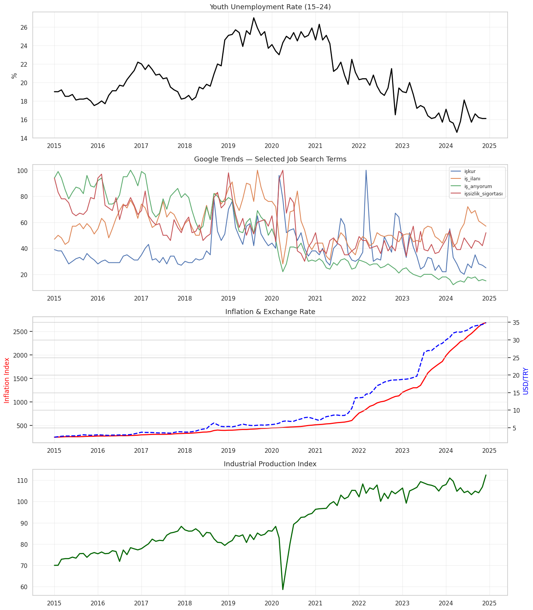
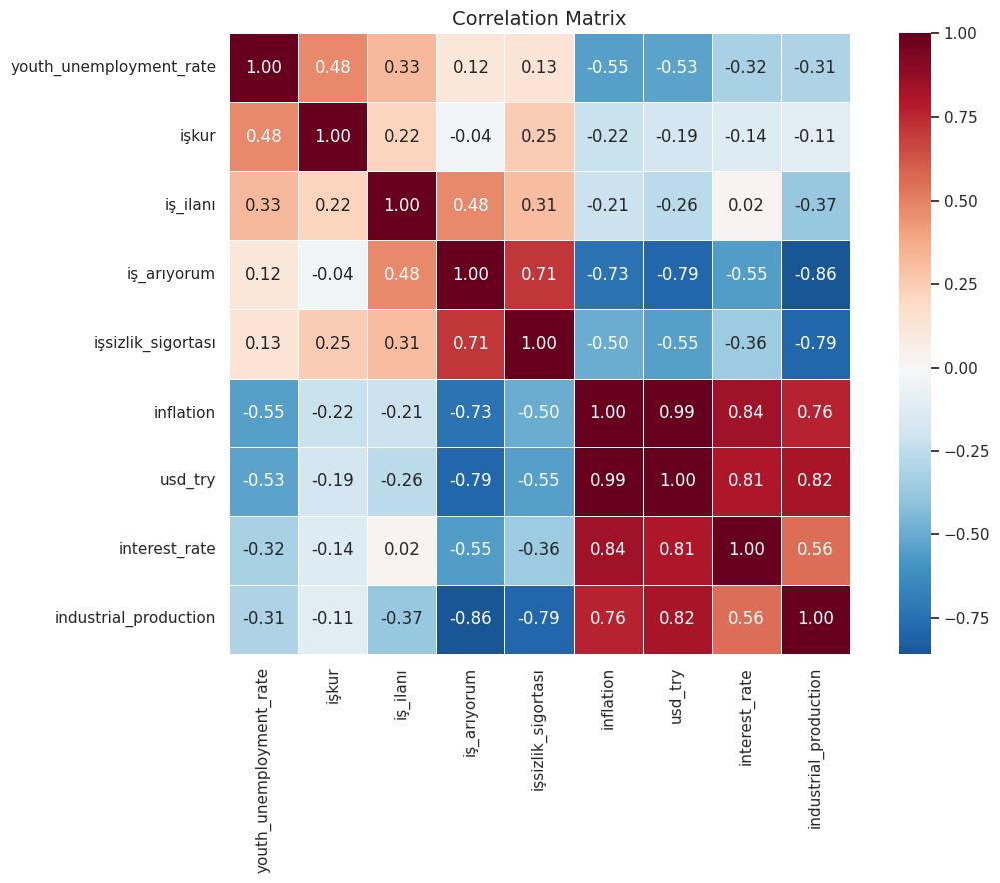
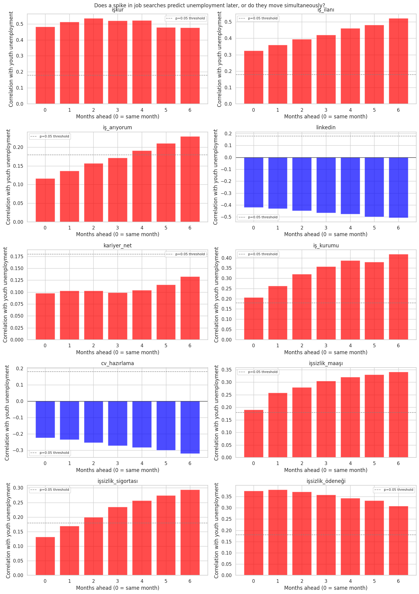
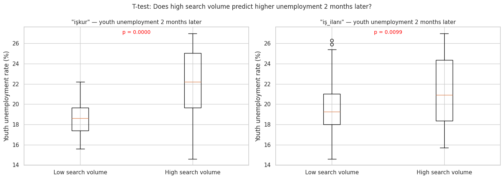
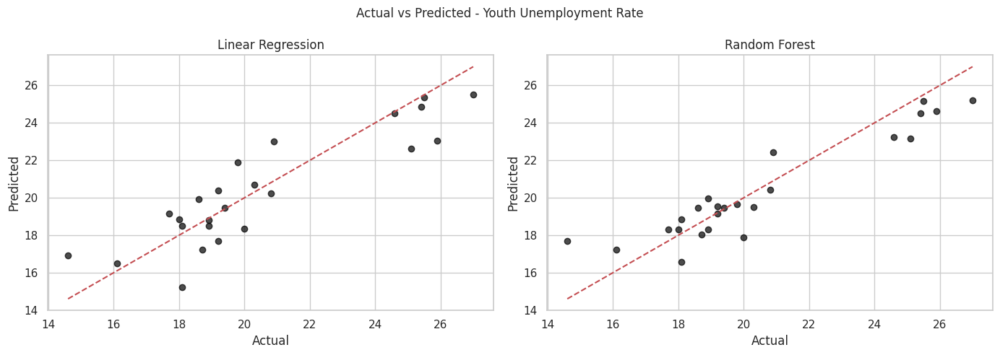
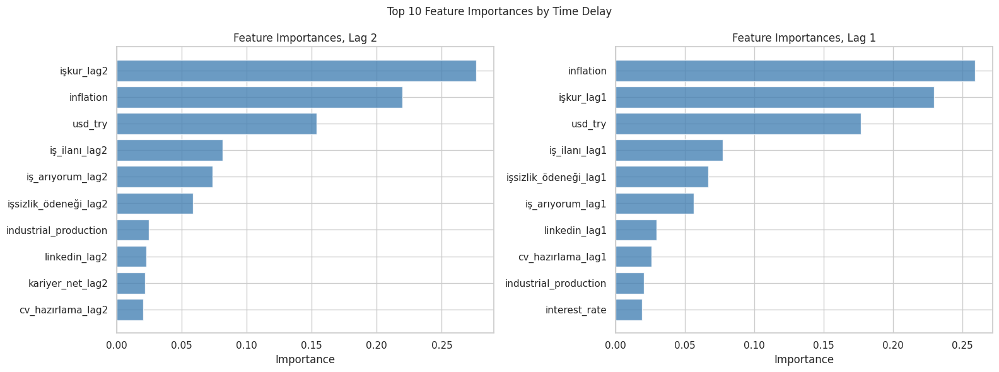
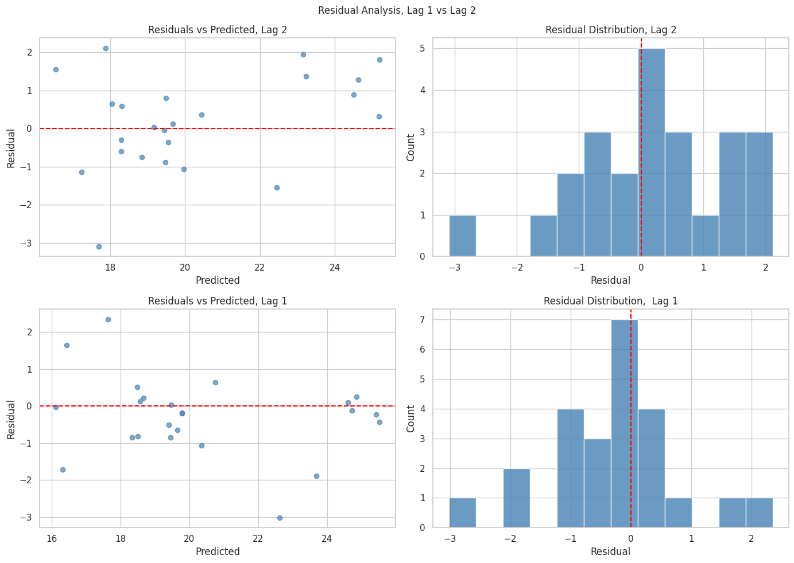
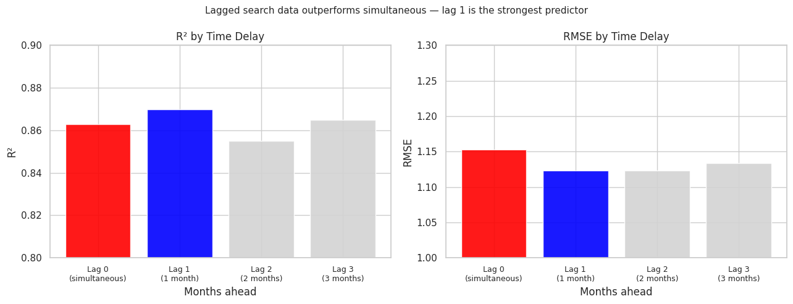
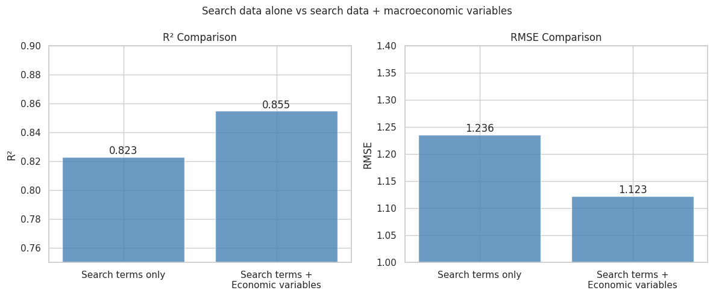

# DSA 210 — Spring 2026
## Does a spike in job-related Google searches predict a rise in youth unemployment with a time delay, or is it simultaneous?

**Ege Öztürk | 34122**

---

## Motivation

Youth unemployment in Turkey has remained high for over a decade, and official TÜİK figures come out with a delay of several weeks. This project investigates how many months in advance job-related Google searches predict a rise in youth unemployment. When labor market conditions worsen, people tend to search for job listings and employment services before any official report captures the shift. The goal is to measure the size of this time delay and test whether it is statistically consistent.

---

## Research Questions

**Main question:**
Does a spike in job-related Google searches predict a rise in youth unemployment with a time delay, or is it simultaneous?

**Sub-questions:**
1. Is the correlation between search terms and unemployment strongest at 0, 1, or 2 months ahead?
2. Which search terms show the strongest correlation with youth unemployment at different time delays?
3. Did the relationship between search behavior and unemployment change during periods of economic shock, such as the 2018 currency crisis or COVID-19?
4. Do search terms associated with lower-educated job seekers (such as "işkur") behave differently from those associated with university graduates (such as "linkedin")?

---

## Data Description

This project uses four data sources, all at monthly frequency and covering January 2015 to December 2024. All sources are merged into a single dataset using the month as a shared key, giving **120 observations and 16 variables** in total.

| Source | Variables | Observations |
|--------|-----------|--------------|
| TÜİK Labour Force Statistics | Youth unemployment rate (ages 15-24) | 120 monthly |
| Google Trends | 10 job-related search terms | 120 monthly |
| TCMB EVDS | Inflation, USD/TRY, interest rate, industrial production | 120 monthly |
| TCMB EVDS | Unemployment insurance applications | 120 monthly |

**Search terms collected:** işkur, iş ilanı, iş arıyorum, linkedin, kariyer.net, iş kurumu, cv hazırlama, işsizlik maaşı, işsizlik sigortası, işsizlik ödeneği

---

## Methods

- **EDA:** Time series plots, correlation matrix
- **Cross-correlation analysis:** Pearson correlation at time delays of 0 to 6 months
- **Hypothesis testing:** Independent samples t-test (high vs low search volume months)
- **Machine learning:** Linear Regression (baseline) and Random Forest, evaluated with 5-fold cross-validation

---

## Results

### 1. Exploratory Data Analysis

The time series overview shows youth unemployment peaked around 2019 (27%) and has declined since. The COVID-19 period (2020) is visible as a sharp dip in industrial production. Inflation and USD/TRY have risen sharply since 2021.

The correlation matrix shows that `işkur` (r = 0.48) and `iş_ilanı` (r = 0.33) have the strongest positive correlations with youth unemployment. Macroeconomic variables like inflation (r = -0.55) and USD/TRY (r = -0.53) show negative correlations, reflecting that the recent period of high inflation coincided with declining youth unemployment.

---

### 2. Cross-Correlation Analysis

We tested whether each search term predicts unemployment at time delays of 0 to 6 months. A positive and growing correlation with increasing lag means the search term leads the unemployment figures.

**Key findings:**
- `işkur` shows the strongest and most consistent positive signal across all lags, peaking at lag 2 (r = 0.54, p < 0.05)
- `iş_ilanı` shows a growing correlation with lag, peaking at lag 3 (r = 0.43, p < 0.05)
- `linkedin` and `cv_hazırlama` show consistent negative correlations — these terms are searched more when the economy is doing well, not when it is struggling
- `iş_arıyorum` shows no statistically significant relationship across any lag
- `işsizlik_ödeneği` shows a significant positive correlation at lag 0, suggesting it reflects real-time distress rather than leading it

---

### 3. Hypothesis Testing

We split months into two groups based on search volume (above/below median) and tested whether youth unemployment 2 months later was significantly different between the groups.

- **H0:** Mean youth unemployment is the same in high and low search volume months
- **H1:** Mean youth unemployment is higher in high search volume months

| Term | High mean | Low mean | t-stat | p-value | Result |
|------|-----------|----------|--------|---------|--------|
| işkur | 22.0% | 18.7% | 6.90 | < 0.001 | Reject H0 |
| iş_ilanı | 21.0% | 19.9% | 2.04 | 0.044 | Reject H0 |
| iş_arıyorum | 20.8% | 20.1% | 1.22 | 0.225 | Fail to reject H0 |

For `işkur`, months with high search volume are followed by unemployment averaging 22.0% two months later, compared to 18.7% in low-search months. This 3.3 percentage point gap is highly significant.

---

### 4. Machine Learning

#### 4.1 Model Comparison

We trained two models using search terms (lagged by 2 months) and macroeconomic variables as features.

| Model | CV RMSE | CV R² |
|-------|---------|-------|
| Linear Regression | 1.455 | 0.754 |
| Random Forest | 1.174 | 0.848 |

Random Forest performed better on 5-fold cross-validation. Both models show consistent test and CV scores, with no signs of overfitting.

#### 4.2 Feature Importance

`işkur_lag2` is the single most important feature at lag 2, accounting for approximately 28% of the model's predictive power. At lag 1, inflation becomes the top feature, with `işkur_lag1` close behind. This shift reflects the strong macroeconomic context of the 2021-2024 period.

#### 4.3 Residual Analysis

Residuals are roughly centered around zero with no strong systematic pattern, suggesting the model does not have a directional bias.

#### 4.4 Time Delay Comparison

We tested Random Forest performance at lags 0 (simultaneous) through 3 months. Lag 1 produces the best R² (0.874) and lowest RMSE (1.121), slightly outperforming lag 0 (R² = 0.863). This directly answers the research question: search data leads unemployment rather than moving with it simultaneously.

#### 4.5 Does Adding Economic Variables Help?

Adding macroeconomic variables (inflation, USD/TRY, interest rate, industrial production) to the Google Trends features improves R² from 0.823 to 0.855 and reduces RMSE from 1.236 to 1.123.

---

## Conclusion

Search data, particularly `işkur`, predicts youth unemployment approximately 1 to 2 months in advance, and this relationship is statistically significant and consistent across all methods used. The cross-correlation analysis identifies the strongest linear signal at lag 2, while the Random Forest model performs best at lag 1. Together, these results suggest the predictive window is 1 to 2 months, and search data leads unemployment rather than moving simultaneously.

---

## Tools and Libraries

- Python, pandas, numpy, matplotlib, seaborn
- scipy.stats (Pearson correlation, t-test)
- sklearn (Linear Regression, Random Forest, cross-validation)
- pytrends (Google Trends API)
- evds (TCMB EVDS API)

---

## AI Assistance

This project used Claude (Anthropic) as an AI assistant for code review, debugging, data pipeline structuring. Full documentation is available in `AiUsage.pdf`.
